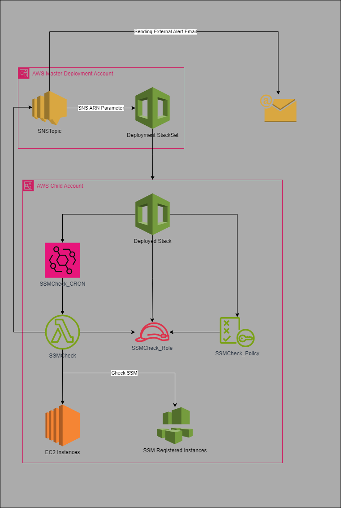

<h1 style='Text-align:center; color:white; padding: 20px;'> AWS - SSM & EC2 Comparison</h1>

### 📃 Architecture 

## 📝 Summary
---
Ensure that all EC2 instances have a working connection to systems manager. This tool will highlight instances that do not.
By default - This is set to run once per week at 13:00, and will send an email to SNS topic for each instance mising SSM.

### 🧪Instructions
---
<li> In a master account, create an SNS topic in the region(s) you'll be deploying the tool to. </li>
<li> Apply the 'SNSPolicy.Json' to the SNS Topic (Editting the account numbers).</li>
<li> Deploy 'Deployment.yml' as a CloudFormation stack/stackset in master account filtering down to desired accounts and regions.</li>

### 🔐Security

 The following IAM permissions are granted/needed. 

#### SNS
<li> Allowing specified accounts to publish to the topic. </li>

#### Lambda
<li>ec2:DescribeInstances - All Resources </li>
<li>ssm:DescribeInstanceInformation - All Resources </li>
<li>sns:Publish - To master SNS </li>
<li>sts:GetCallerIdentity - All resources </li>

### 👨‍💻 Author
---
Tom Bindloss

